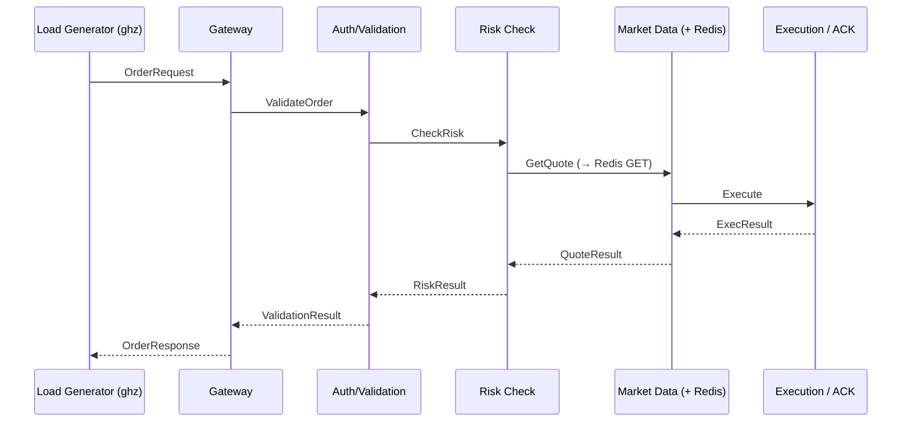

# 2. Latency-Critical RPC Pipeline Design

## 2.1 Architecture: 5-Hop gRPC Order Pipeline

The pipeline models a simplified HFT order-entry path. Each service is a stateless Go
binary (~200 LOC) exposing a single gRPC unary RPC.



### Call Graph Summary

| Hop | Service | Upstream | Downstream | Dependency |
|-----|---------|----------|------------|------------|
| 0 | **Gateway** | Load Generator | Auth | — |
| 1 | **Auth** | Gateway | Risk | — |
| 2 | **Risk** | Auth | MarketData | — |
| 3 | **MarketData** | Risk | Execution | Redis (GET) |
| 4 | **Execution** | MarketData | — (returns) | — |

### Key Design Properties

- **Protocol**: gRPC (HTTP/2) with unary RPCs. Protobuf payload.
  - HTTP/1.1 comparison via gRPC-Gateway sidecar for select experiments.
- **Request size**: Configurable via proto field: `bytes payload = N;`
  Default: 256 B request, 128 B response (representative of FIX-style messages).
- **Fanout**: Strictly serial (no fan-out). This isolates per-hop amplification
  without fan-out noise. Stretch goal: 2× fan-out at Risk stage.
- **Processing delay**: Each service adds configurable simulated compute to model
  real work. Default: 50 µs per hop.

  > ⚠️ **`time.Sleep` is banned for microsecond delays.** Sleep is scheduler-driven
  > with timer granularity artifacts — it injects the exact scheduling effects being
  > measured. Use only:
  > - **Calibrated busy-spin**: loop on `time.Now()` (backed by `CLOCK_MONOTONIC`)
  >   until target duration elapsed
  > - **Real compute**: fixed-iteration SHA-256 hashing or protobuf encode/decode,
  >   calibrated at startup to match target delay
  >
  > ```go
  > // Busy-spin delay (preferred)
  > func busySpin(target time.Duration) {
  >     start := time.Now()
  >     for time.Since(start) < target {}
  > }
  > ```
  >
  > **Enforcement**: Add a CI-level guard to prevent accidental Sleep usage:
  > ```go
  > // delay_test.go — must pass in CI
  > func TestNoSleepForMicrosecondDelays(t *testing.T) {
  >     cfg := loadConfig()
  >     if cfg.DelayMode == "sleep" && cfg.DelayDuration < time.Millisecond {
  >         t.Fatal("time.Sleep banned for delays < 1ms; use busyspin or compute mode")
  >     }
  > }
  > ```
  > Additionally, `go vet` or `grep -rn 'time.Sleep' services/` in CI to catch
  > any accidental Sleep calls in service code.
- **Redis dependency**: MarketData performs a single `GET` to Redis for quote
  lookup. Redis runs as a separate pod (single replica, no persistence).
  This introduces a realistic external-dependency tail (Redis p99 ≈ 100–300 µs).

---

## 2.2 Implementation Details

### Language & Framework
- **Go 1.22+** with `google.golang.org/grpc`
- Each service: ~200 LOC, single `main.go` + proto-generated code
- Shared `proto/order.proto` defining all RPCs

### Protobuf Definition (sketch)

```protobuf
syntax = "proto3";
package order;

service GatewayService {
  rpc SubmitOrder(OrderRequest) returns (OrderResponse);
}
service AuthService {
  rpc ValidateOrder(OrderRequest) returns (ValidationResult);
}
service RiskService {
  rpc CheckRisk(OrderRequest) returns (RiskResult);
}
service MarketDataService {
  rpc GetQuote(QuoteRequest) returns (QuoteResult);
}
service ExecutionService {
  rpc Execute(ExecRequest) returns (ExecResult);
}

message OrderRequest {
  string order_id = 1;
  string symbol = 2;
  int64  quantity = 3;
  double price = 4;
  bytes  payload = 5;  // Configurable size
  map<string, string> metadata = 6;
}
// ... (remaining messages follow same pattern)
```

### OpenTelemetry Instrumentation

Each service uses `go.opentelemetry.io/contrib/instrumentation/google.golang.org/grpc/otelgrpc`
for automatic span creation on every gRPC call.

```
Trace: [Gateway span] → [Auth span] → [Risk span] → [MarketData span] → [Execution span]
                                                           └─ [Redis GET span]
```

- Exporter: OTLP → Jaeger (all-in-one, deployed as a pod).
- Propagation: W3C TraceContext via gRPC metadata.
- Each span records: `service.name`, `rpc.method`, `net.peer.name`,
  `host.name` (pod name), custom attributes: `sched_delay_us` (injected by
  eBPF sidecar or post-hoc correlation).

### Load Generator

Primary: **`ghz`** (https://ghz.sh) — gRPC benchmarking tool.

```bash
ghz --insecure \
    --proto proto/order.proto \
    --call order.GatewayService/SubmitOrder \
    --data '{"order_id":"{{.RequestNumber}}","symbol":"AAPL","quantity":100,"price":150.0}' \
    --connections=4 --concurrency=16 \
    --rps 2000 --duration 120s \
    --format json \
    gateway-svc:50051
```

**Burst mode**: Custom Go wrapper around ghz that injects periodic microbursts:
- Base rate: 1000 req/s
- Burst: 5000 req/s for 50ms every 2 seconds
- This models HFT-style bursty market-data–driven traffic.

---

## 2.3 Kubernetes Deployment

### Base Deployment (Kustomize)

```
deploy/
├── base/
│   ├── kustomization.yaml
│   ├── namespace.yaml          # latency-lab namespace
│   ├── gateway-deployment.yaml
│   ├── auth-deployment.yaml
│   ├── risk-deployment.yaml
│   ├── marketdata-deployment.yaml
│   ├── execution-deployment.yaml
│   ├── redis-deployment.yaml
│   ├── jaeger-deployment.yaml
│   └── services.yaml           # ClusterIP services for all
├── overlays/
│   ├── E1-baseline/            # same-node, no limits, no contention
│   ├── E2-cross-node/          # cross-node placement
│   ├── E3-cpu-limited/         # 200m CPU limit per pod
│   │   └── kustomization.yaml  # patches resources.limits.cpu
│   ├── ...
│   └── E15-full-mitigation/
└── scripts/
    ├── setup-cluster.sh
    ├── label-nodes.sh
    └── run-experiment.sh
```

### Node Requirements
- **2-node cluster** (minimum): `node-a` (latency-critical pods), `node-b` (cross-node placement + stressor)
- **Kernel**: 5.15+ (BTF support for CO-RE, cgroup v2)
- **kubeadm** cluster with `--cpu-manager-policy=static` for pinning experiments
- Nodes labeled: `role=primary`, `role=secondary`

### Pod Placement Control
- `nodeSelector` + `nodeAffinity` rules in overlays
- `podAffinity` for same-node co-location
- `podAntiAffinity` for cross-node spread
- Taints/tolerations for dedicated experiment nodes
