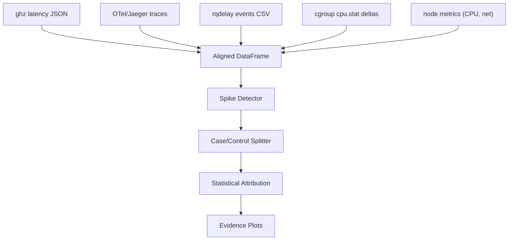

# 6. Correlation & Analysis Plan

## 6.1 Clock Synchronization

All nodes must have synchronized clocks. Target: **< 500 µs typical** with chrony.
Cross-node analysis uses **100 ms windows**, so residual skew up to ~1 ms is
tolerable for windowed correlation — individual event ordering across nodes is
unreliable at sub-ms granularity.

| Method | Setup | Verification |
|--------|-------|-------------|
| **chrony** (primary) | Install on all nodes; configure with same NTP pool | `chronyc tracking` → "System time" offset < 500 µs |
| **PTP** (stretch) | If NIC supports hardware PTP | `ptp4l` + `phc2sys` |

**Fallback**: If clock skew > 1 ms, use per-node–relative timestamps with
cross-node offset correction derived from gRPC round-trip measurement.

---

## 6.2 Correlation Architecture



### Data Sources & Alignment

| Source | Timestamp Format | Alignment Key |
|--------|-----------------|---------------|
| ghz latency | Unix epoch (ns) | Request timestamp |
| OTel spans | Unix epoch (ns), trace_id | trace_id → ghz request mapping via header |
| rqdelay events | ktime_ns (monotonic) → converted to wall-clock | cgroup_id + timestamp window |
| cgroup cpu.stat | Wall-clock at poll time (100ms granularity) | Pod name + timestamp window |
| /proc/net/sockstat | Wall-clock at poll time | Node + timestamp window |

**Alignment procedure**:
1. Convert all timestamps to Unix epoch nanoseconds
   - **ktime_ns → epoch_ns conversion**: At experiment start, capture the boot-time
     offset on each node: `epoch_offset = wall_clock_ns - ktime_get_ns()`. Record
     this once per node per experiment run. Convert all eBPF ktime_ns events as:
     `epoch_ns = ktime_ns + epoch_offset`. Verify offset stability across the
     experiment duration (should drift < 100 µs over 3 minutes if chrony is running).
2. Bucket into 100ms windows (aligned to experiment start time)
3. For each window, compute: app_p99, wakeup_delay_p99, softirq_time_total,
   throttled_usec_delta, retrans_count
4. Join on window_id + pod_name → unified time-series DataFrame

---

## 6.3 Tail Spike Detection

**Method**: Sliding-window p99/p999 with window = 1 second, step = 100 ms.

```python
# Pseudocode
for window in sliding_windows(latencies, width=1s, step=100ms):
    p999 = np.percentile(window.values, 99.9)
    if p999 > baseline_p999 * 2.0:
        mark_as_spike(window)
```

A **spike window** is any 1-second window where p999 exceeds 2× the baseline
(E1) p999. A **calm window** is any window where p999 < 1.2× baseline.

---

## 6.4 Case/Control Analysis

For each experiment with observed spikes:

| Group | Definition | N (target) |
|-------|------------|------------|
| **Case** (slow requests) | Requests with latency > experiment p99 | ~1% of requests |
| **Control** (fast requests) | Requests with latency in [p40, p60] (median band) | ~20% of requests |

For each group, compute kernel event density in the 100ms window surrounding the
request:

| Kernel Signal | Case Group (expected) | Control Group (expected) |
|---------------|----------------------|--------------------------|
| wakeup_delay_p99 | High (> 100 µs) | Low (< 20 µs) |
| softirq_time_total | High | Low |
| ksoftirqd_activations | Present | Absent or rare |
| throttled_usec_delta | > 0 | = 0 |
| tcp_retransmit_count | Elevated | Near zero |

**Statistical test**: Mann-Whitney U test for each signal (non-parametric, no
normality assumption). Report p-value and effect size (Cliff's delta).

---

## 6.5 Attribution Workflow (Step-by-Step)

### Phase 1: Data Collection (per experiment)

```bash
# 1. Deploy experiment overlay
make deploy-E7

# 2. Wait for pods ready
kubectl wait --for=condition=ready pod -l app=pipeline -n latency-lab --timeout=120s

# 3. Start rqdelay on all nodes
ssh node-a "sudo ./rqdelay --output /data/E7/node-a/ --duration 210s" &
ssh node-b "sudo ./rqdelay --output /data/E7/node-b/ --duration 210s" &

# 4. Start cgroup stat collector
./collect-cgroup-stats.sh --interval 100ms --output /data/E7/cgroup/ --duration 210s &

# 5. Warm up (30s)
ghz --rps 2000 --duration 30s ... > /dev/null

# 6. Measurement run (120s steady + 60s burst)
ghz --rps 2000 --duration 120s --format json ... > /data/E7/ghz-steady.json
./burst-generator --base-rps 1000 --burst-rps 5000 --burst-dur 50ms --period 2s \
    --duration 60s --output /data/E7/ghz-burst.json

# 7. Collect Jaeger traces
curl "http://jaeger:16686/api/traces?service=gateway&limit=50000" > /data/E7/traces.json

# 8. Tear down
make teardown-E7
```

### Phase 2: Data Processing

```python
# 1. Parse all sources into DataFrames
df_ghz = parse_ghz_json("data/E7/ghz-steady.json")
df_traces = parse_jaeger_traces("data/E7/traces.json")
df_sched = parse_sched_lint_csv("data/E7/node-a/events.csv", "data/E7/node-b/events.csv")
df_cgroup = parse_cgroup_stats("data/E7/cgroup/")

# 2. Align to 100ms windows
df_aligned = align_to_windows(df_ghz, df_traces, df_sched, df_cgroup, window_ms=100)

# 3. Detect spikes
df_spikes = detect_spikes(df_aligned, baseline_p999=E1_p999, threshold=2.0)

# 4. Case/control split
case, control = case_control_split(df_aligned, df_ghz, p_threshold=99)

# 5. Statistical tests
for signal in ['wakeup_delay_p99', 'softirq_time', 'throttled_usec', 'retrans_count']:
    u_stat, p_val = mannwhitneyu(case[signal], control[signal])
    effect = cliffs_delta(case[signal], control[signal])
    print(f"{signal}: U={u_stat}, p={p_val:.4f}, Cliff's d={effect:.3f}")
```

### Phase 3: Mechanism Proof

For each hypothesis H1–H3:
1. Show the signal is elevated in the hypothesized experiment
2. Show mitigation removes the signal (E13–E15)
3. Show p999 drops when signal is removed
4. Confirm via scatter plot: signal intensity vs. p999

---

## 6.6 Evidence Plots (Final Figures)

| Plot | X-axis | Y-axis | Experiments Shown |
|------|--------|--------|-------------------|
| **Fig 1**: p999 bar chart | Experiment ID | p999 (µs) | All E1–E15 |
| **Fig 2**: Wakeup delay vs p999 | wakeup_delay_p99 (µs) | app p999 (µs) | E1, E4, E6, E7, E13, E14 |
| **Fig 3**: CDF overlay | Latency (µs) | CDF | E1 vs E3 vs E7 vs E15 |
| **Fig 4**: Throttle timeline | Time (s) | throttled_usec_delta | E3, E10 |
| **Fig 5**: softirq vs runqueue | softirq_time_us/s | wakeup_delay_p99 | E1, E4, E8 |
| **Fig 6**: Cross-node effect | Placement (SN/XN) | p999 ratio | E1 vs E2, E4 vs E6 |
| **Fig 7**: Mitigation waterfall | Mitigation applied | p999 reduction (%) | E7, E13, E14, E15 |
| **Fig 8**: Burst response | Time since burst (ms) | p999 | E1 burst, E7 burst |
| **Fig 9**: Retrans vs tail | retrans/s | p999 (µs) | E2, E6, E7 |
| **Fig 10**: Decomposition | Hop (1–5) | Per-hop p99 (µs) stacked | E1, E7, E15 |
